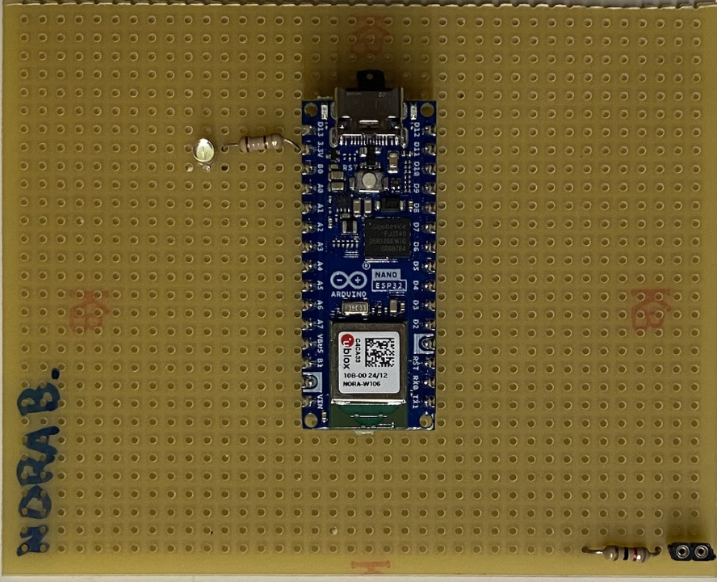
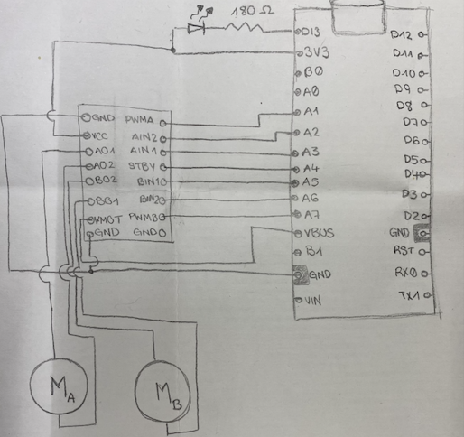
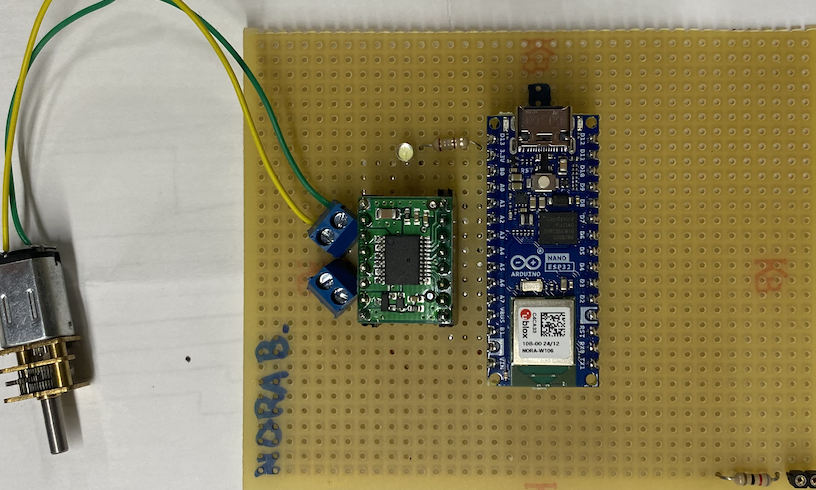
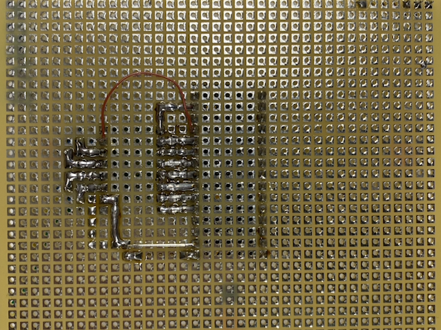
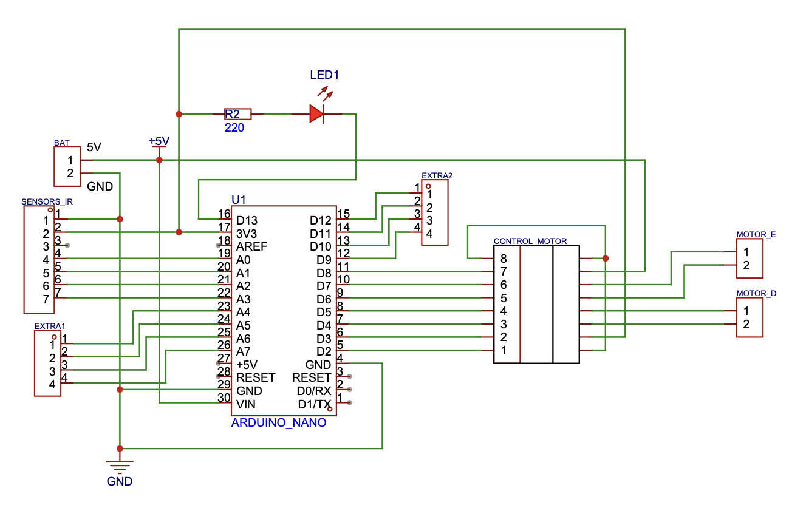
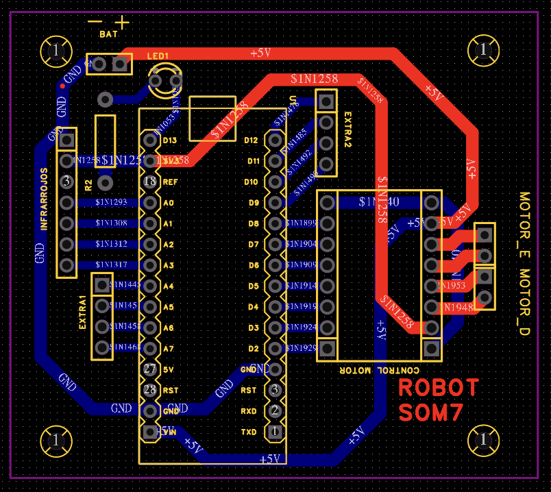

# Construcció d'un seguidor de línies amb un Arduino

Hem construït un robot seguidor de línies a partir de zero. Ho fem amb unes noies que ens trobem cada dissabte un parell d'hores. Aquí aniré descrivint què fem cada dissabte i a través dels diferents comits es pot veure com va creixen el projecte.

## 19/10/24 Instal·lació eines
Instal·lació de Visual Studio Code i Github. Repàs del que fa el Visual Studio Code. Instal·lació de l'extensió PlatformIO.

## 26/10/24 Introducció i Teoria
Una mica de teoria sobre Tensió, Current, què és un microcontrolador, programar, compilar...
Aprendre a programar l'arduino. Fer un programa que envïi un "Hello world!" pel Monitor i fer vagi engegant i parant el LED que porta l'Arduino. Canviem de colors.

## 09/11/24 Aprenem a soldar
Fem pràctiques de soldadura. Comencem estanyant un fil i acabem soldant una resistència i un petit sòcul a la protoboard, només per practicar.
Soldem el sòcul per posar l'arduino a la protoboard. 

## 16/11/24 LEDs i funcions
Aprenem com funciona un LED i soldem un LED amb la seva resistència a la protoboard, per poder-lo activar des de D13.
Fem un programa que engega i apaga el LED que hem soldat.
Aprenem què és una funció i fem una funció que engega el LED i una altra que l'apaga.
<p align="center">
  
</p>

## 30/11/24 Funció LED colors
Practiquem amb funcions i creem una funció per configurar el LED de color i una altra per posar el LED de color al color que volem. També creem colors propis amb #define que definim un color.
Hem vist el que era un repositori de codi i ens hem creat un compte a Github.

## 07/12/24 Introducció motors
Hem acabat de posar en marxa el Github i hem fet algunes pràctiques de fer commits i veure els canvis fets.
Hem vist els diferents motors que hi ha i les seves aplicacions. Hem vist què passa quan posem més o menys tensió a un motor DC i quan li canviem la polaritat. Hem començat a muntar el controlador

## 21/12/24 Muntatge controlador motor
Hem cablejat el motor i hem après a fer servir un tester per mirar continuïtat i comprovar si tot ho havíem soldat bé.
De moment el motor el tenim connectat al VBUS, l'alimentació del USB.





## 11/01/25 Funcions bàsiques de control de motor
Hem configurat les sortides per controlar el motor, hem creat una funció per configurar el motor(setup_motor) i unes funcions per fer anar el motor 1 en un sentit (motorEndavantE) i en un altre (motorEnreraE). De moment el motors només volten a màxima velocitat. També hem fet una funció per parar el motor (motorStopE).

A loop hem fet que el motor giri cap a un sentit durant 1s, es pari i giri cap a l'altre sentit durant 1s.

## 25/01/25
Avui hem treballat poc hem instal·lat el Copilot, l'hem après a fer funcionar i hem fet que la funció motorrEndavantE(int speed) li poguem passar un paràmetre amb la velocitat.

## 01/02/24
Pràctiques amb el Copilot. Hem après què són els bucles for i hem fet algunes pràctiques.

```cpp
void loop() {
  Serial.println("Hello World");
  //Fes un bucle que enviï pel canal serie un missatge que digui "El número X" on X és un número de 1 a 10 que incrementa en cada iteració
  for(int i = 0; i < 10; i++){
    Serial.print("El número ");
    Serial.println(i);
    delay(1000);
  }
  //Prova la funció /explain del copilot
  //Fes un bucle que enviï pel canal serie un missatge que digui "El número X" on X és un número de 1 a 10 que decrementa en cada iteració
  for(int i = 10; i > 0; i--){
    Serial.print("El número ");
    Serial.println(i);
    delay(1000);
  }
  //Fes un bucle que enviï pel canal serie un missatge que digui "El número X" on X és un número de 1 a 10 que incrementa en cada iteració, però saltant els números de 2 en 2
  for(int i = 0; i < 10; i += 2){
    Serial.print("El número ");
    Serial.println(i);
    delay(1000);
  }
  //Fes un bucle que enviï pel canal serie les taules de multiplicar, enviant "X per Y igual a Z" on X i Y són els números de 1 a 10 i Z és el resultat de multiplicar-los
  for(int i = 0; i < 10; i++){
    for(int j = 0; j < 10; j++){
      Serial.print(i);
      Serial.print(" per ");
      Serial.print(j);
      Serial.print(" igual a ");
      Serial.println(i*j);
    }
  }
```

## 08/02/24
Hem creat les funcions per engegar el motor suaument i hem conegut la instrucció de compilador #if per que es compili codi segons el valor de la constant DEBUG.
```cpp
#define DEBUG TRUE

// Funcio que arranca suaument els motor cap enrera 
// speed: Velocitat dels 2 motors (0-255)
// acceleracio: Valor de l'acceleració (0-255)
void motorArrancaSuauEnrera(int speed, int acceleracio){
  //Engegar el motor enrera incrementant la velociatat segons el valor d'acceleració, utilitzant la funcio motorEnrera
  for(int i = 0; i <= speed; i+=acceleracio){
    motorEnrera(i, i);
    delay(10);
  }

  #if DEBUG
  //Enviar per serial que el motor arranca suau enrera i la velocitat
    Serial.print("Motors arranca suau enrera: ");
    Serial.println(speed);
  #endif
}
```

## 15/02/25
Hem modificat les funcions de moure motor i parar per que actuin sobre els dos motors.
```cpp
// Funció que engega endavant els 2 motors
// speedE: Velocitat del motor esquerre(0-255)
// speedD: Velocitat del motor dret (0-255)
void motorEndavant(int speedE, int speedD)
{
  digitalWrite(pinSTBY, HIGH);
  digitalWrite(pinAIN1, HIGH);
  digitalWrite(pinAIN2, LOW);
  analogWrite(pinPWMA, speedE);
  digitalWrite(pinBIN1, HIGH);
  digitalWrite(pinBIN2, LOW);
  analogWrite(pinPWMB, speedD);

  #if DEBUG
    //Enviar per serial que el motor va endavant i la velociat de cada motor
    Serial.print("Motor endavant: ");
    Serial.print(speedE);
    Serial.print(" ");
    Serial.println(speedD);
  #endif
}
```

## 22/02/25
Avui hem fet poca cosa. Hem fet un connector per poder connectar el mòdul de les piles a la placa.

## 01/03/25
Ara volem incorporar el sensosr d'infrarrojos, però hem vist que necessitem utilitzar les entrades analògiques i les tenim ocupades pel control de motor. Això vol dir que hem de tornar a refer el prototípus que teníem. Com que ja hem après a fer prototipus, avui ens hem dedicat a veure com es fa una PCB amb el programa [EasyEDA](https://easyeda.com/). No els hi he fet fer, jo l'he dibuixat i elles han vist com es feia.

I ara tenim aquest esquema:


I aquesta placa:



