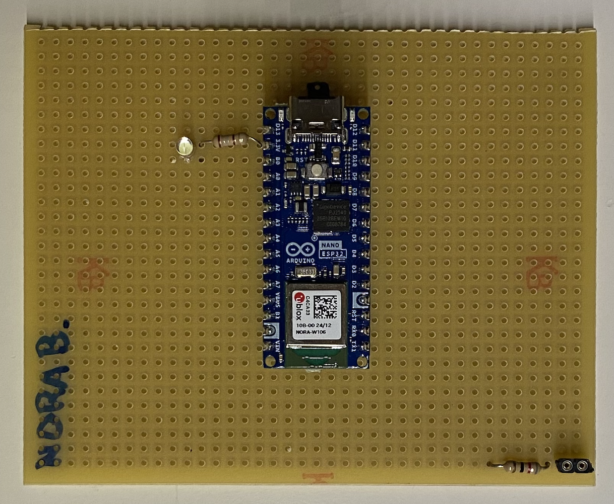

# Construcció d'un seguidor de línies amb un Arduino

Hem construït un robot seguidor de línies a partir de zero. Ho fem amb unes noies que ens trobem cada dissabte un parell d'hores. Aquí aniré descrivint què fem cada dissabte i a través dels diferents comits es pot veure com va creixen el projecte.

## 19/10/24 Instal·lació eines
Instal·lació de Visual Studio Code i Github. Repàs del que fa el Visual Studio Code. Instal·lació de l'extensió PlatformIO.

## 26/10/24 Introducció i Teoria
Una mica de teoria sobre Tensió, Current, què és un microcontrolador, programar, compilar...
Aprendre a programar l'arduino. Fer un programa que envïi un "Hello world!" pel Monitor i fer vagi engegant i parant el LED que porta l'Arduino. Canviem de colors.

## 09/11/24 Aprenem a soldar
Fem pràctiques de soldadura. Comencem estanyant un fil i acabem soldant una resistència i un petit sòcul a la protoboard, només per practicar.
Soldem el sòcul per posar l'arduino a la protoboard. 

## 16/11/24 LEDs i funcions
Aprenem com funciona un LED i soldem un LED amb la seva resistència a la protoboard, per poder-lo activar des de D13.
Fem un programa que engega i apaga el LED que hem soldat.
Aprenem què és una funció i fem una funció que engega el LED i una altra que l'apaga.

## 30/11/24 Funció LED colors
Practiquem amb funcions i creem una funció per configurar el LED de color i una altra per posar el LED de color al color que volem. També creem colors propis amb #define que definim un color.
Hem vist el que era un repositori de codi i ens hem creat un compte a Github.

## 07/12/24 Introducció motors
Hem acabat de posar en marxa el Github i hem fet algunes pràctiques de fer commits i veure els canvis fets.
Hem vist els diferents motors que hi ha i les seves aplicacions. Hem vist què passa quan posem més o menys tensió a un motor DC i quan li canviem la polaritat. Hem començat a muntar el controlador

## 21/12/24 Muntatge controlador motor
Hem cablejat el motor i hem après a fer servir un tester per mirar continuïtat i comprovar si tot ho havíem soldat bé.

